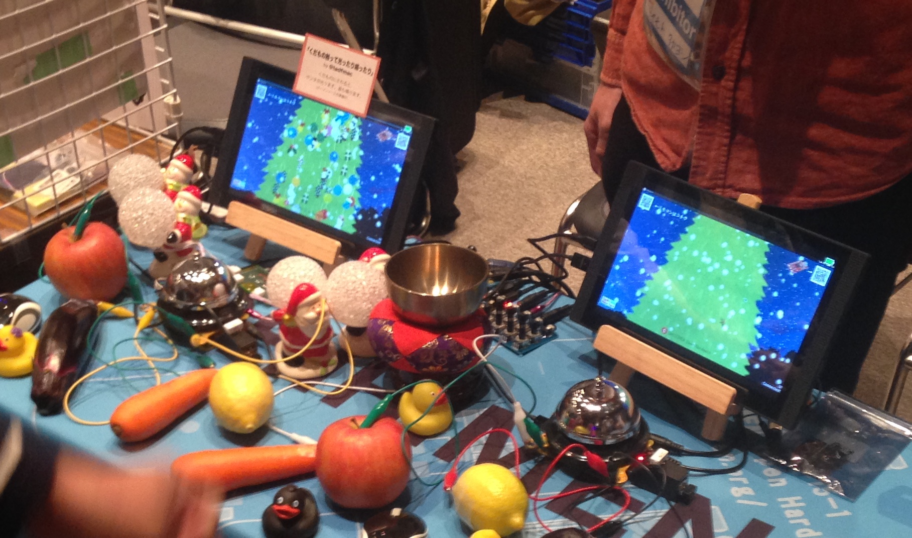

# OMMF2016 

[ogaki mini maker faire 2016]()でCHIRIMEN Open Hardwareコミュニティの展示のに展示した「くだもの触って光ったり鳴ったり」のソースコードです。

## cheen-rimen

CHIRIMEN用シールド「CHEEN-RIMEN」のデータです。
CHEEN-RIMENはダイソーで販売している「呼び鈴ベル（通称：ちーん）」を搭載することができるシールドです。呼び鈴を手動で鳴らした時の情報をCHIRIMEN側にI2C経由で伝えることができます。また搭載した呼び鈴はソレノイドで鳴動することもできます。
さらにボリューム調整機能つきオーディオ出力端子や4つのGPIO端子、切り替えつき外部電源端子、4つの外部負荷付きタッチセンサー端子など豊富な機能をCHIRIMENに拡張可能です。

ここで公開する情報には、eagleファイルと、CHEEN-RIMENに搭載されたATmega8A用のファームウエア（Arduino Sketch）が含まれています。

## cont

スマホをコントローラにするWebアプリです。
ボタンを押すことでommfapp側にアヒルを投げ込みます。

## ommfapp

CHIRIMEN用のアプリです。タッチセンサー（に繋いだくだものや野菜など）を触ることでクリスマスツリーにオーナメントを飾り付けしながら「ちーん」音を鳴らします。GPIOに繋がったサンタも光ります。また、contのボタンが押された時にアヒルが飛んできます。

